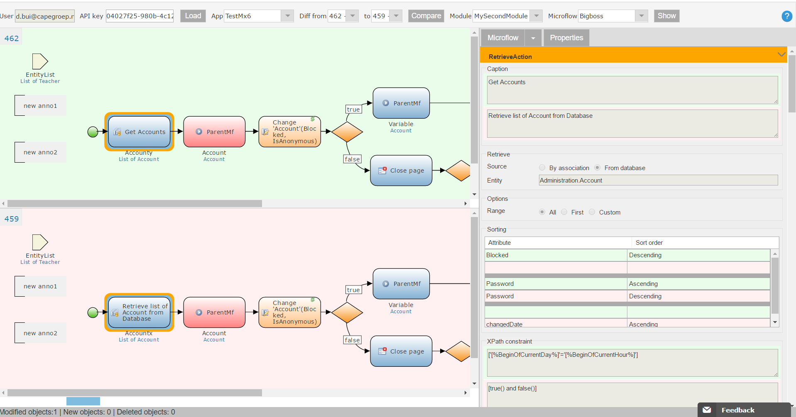

# mfdiff_electrons
This is code for "Application to compare 2 revisions of Mendix including Microflow and DomainModel"  by using ReactJS.

# Overview

This is the code for [this](https://appstore.home.mendix.com/link/app/60761/SCH/Mendix-DiffTool) application on Mendix Appstore by using ReactJS.

[This link](https://youtu.be/hNBJ8GYcc0U) is the demo video.

# Description

Utility to compare 2 revisions of Mendix including Microflow and DomainModel.
Utility to compare 2 revisions of Mendix. The tool is designed to compare all aspect of Mendix:

 - Microflow (now)

 - Domain model (now)

 - Form

 - Security

 - Widget configuration

# Typical usage scenario

 - Track changes of previous commits to find bugs

 - To have more insight about a commit than just its general description 

 - To revert some simple changes from previous commits

# Feature and limitations

 - Have precise  comparison: Properties of microflow action, properties of microflow
 - Have Intuitive interaction to navigate the changes:
     - Coloring border of modified (blue), inserted (green), deleted (red) microflow action
     - Side-by-side visual differencing
     - Click to navigate/highlight changes and corresponding microflow action
     - Overview bar of all changes
     - Hide/show the similar information
     - Hide/show side or position difference

# Dependencies
 - Mendix user and ApiKey. Get one at: https://docs.mendix.com/apidocs-mxsdk/apidocs/authentication